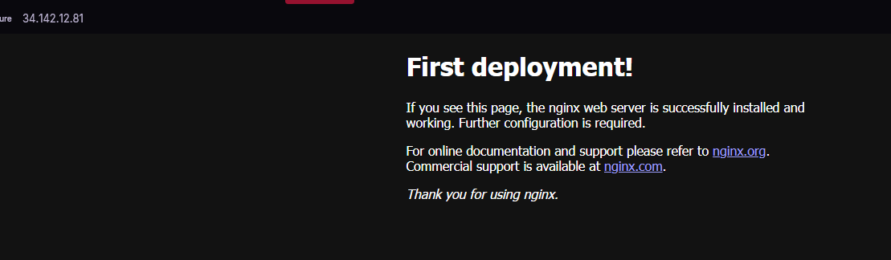

# GCP Cloud Journey ☁️

Hands-on journey into cloud engineering using Google Cloud Platform.  
Focus on building real systems, not just learning theory.

---

## 🚧 Progress

- [x] Day 1 – GCP setup (project, CLI, authentication)
- [x] Day 2 – VM + nginx (first public deployment)
- [x] Day 3 – Cloud Storage (GCS, public hosting)
- [x] Day 4 – VM → GCS pipeline (compute + storage integration)

---

## 🧱 What I'm building

Learning cloud engineering by creating real, working components:

- Managing infrastructure (Compute Engine)
- Working with cloud storage (GCS)
- Understanding IAM and access control
- Building simple data pipelines
- Debugging real-world cloud issues

---

## ⚙️ Tech Stack

- Google Cloud Platform (GCP)
- Compute Engine (VM)
- Cloud Storage (GCS)
- gcloud CLI / gsutil
- Linux (Ubuntu)

---

## 🌐 Demo

### Day 2 – First deployment (VM + nginx)

---

### Day 3 – Static file hosting (GCS)
Public file served directly from storage:

https://storage.googleapis.com/logro-cloud-bucket-12345/index.html

---

### Day 4 – VM → GCS pipeline

Data generated on VM and uploaded to cloud storage:

https://storage.googleapis.com/logro-cloud-bucket-12345/data.txt

*(Content includes timestamp generated on VM)*

---

## 🧠 Key Learnings

- Cloud resources are API-driven, not physical machines
- Compute and storage are separate layers
- IAM controls access, but scopes and tokens also matter
- Public access must be explicitly configured
- Real cloud work involves debugging, not just setup

---

## 🧩 Architecture (so far)

VM (Compute Engine)
↓
generates data
↓
uploads to
↓
GCS (Cloud Storage)
↓
accessible via public URL

---

## 🐛 Debugging Experience

Encountered and resolved real-world issues:

- IAM roles vs access scopes confusion
- Access token behavior and refresh
- VM service account permissions
- CLI inconsistency (`gcloud storage` vs `gsutil`)
- Permission errors despite correct configuration
